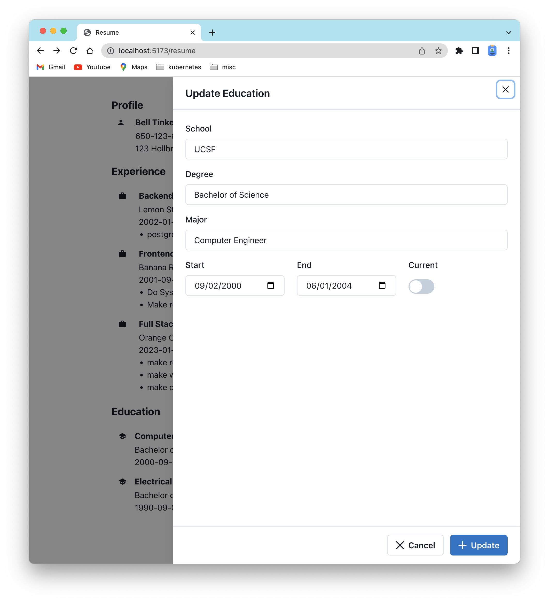

# Introduction

Make an resume editor, so that user can create/retreive/update/delete user profile, work experience, school education, etc.,
1. run `npm run dev` to start the server and point your broswer to `http://localhost:5173/resume`
1. see demo 
   [](https://youtu.be/BWqaPQk-u0A)

# Stack

1. postgres dbms (good for relational db)
1. supabase (with the rpc api, generated typescript from postgres)
1. hook (to manage state)
1. react (with chakra, router)

# Directory

1. `.env` has values to load supabase key/secret, which the developer must create. (see `.env-example` for example)
```
VITE_SUPABASE_URI='https://db.<MUST_GET_YOUR_SUPABSE_URI>.supabase.co'
VITE_SUPABASE_ANON_KEY='<MUST_GET_YOUR_SUPABASE_ANON_KEY>'
```
1. `main.tsx` is the JSX entry point to `<Resume/>` (thru `routes.tsx`).
1. `api/` is for supbase rpc to communicate from frontend to backend, heavily templated for reusing with different tables.
1. `components/` is for all RSX components.
1. `hooks/` is for various hooks to manage resume editing possible.
1. `sql/` is for SQL tables (view, function, procedure, trigger, enum if any)
1. `doc/` for documentation...

# Database

1. see `sql/postgres.sql` for the SQL tables.
1. see `doc/resume-db-erd.png` for the Entity Relational Diagram.
   

# Layout

1. resume (root)
   this is the landing page for `/resume` route. here user will find three sections: profile, experience, and education)
   
1. `Profile`
   this section has profile itself plus address and phone. user can only update at the moment. But the database is design for multi-user use case.
   
1. `Experience`
   this section list the user work experiences, which can be added, updated, or deleted.
   
   
   
1. `Education`
   this sectoin list user school, which can be added, updated, or deleted.
   
   
   
